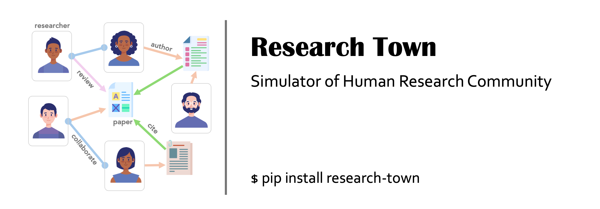

## Abstract

Large Language Models (LLMs) have demonstrated remarkable potential in scientific domains, yet a fundamental question remains unanswered: Can we simulate human research communities with LLMs? Addressing this question can deepen our understanding of the processes behind idea brainstorming and inspire the automatic discovery of novel scientific insights. In this work, we propose ResearchTown, a multi-agent framework for research community simulation. Within this framework, the human research community is simplified and modeled as an agent-data graph, where researchers and papers are represented as agent-type and data-type nodes, respectively, and connected based on their collaboration relationships. We also introduce TextGNN, a text-based inference framework that models various research activities (e.g., paper reading, paper writing, and review writing) as special forms of a unified message-passing process on the agent-data graph. To evaluate the quality of the research simulation, we present ResearchBench, a benchmark that uses a node-masking prediction task for scalable and objective assessment based on similarity. Our experiments reveal three key findings: (1) ResearchTown can provide a realistic simulation of collaborative research activities, including paper writing and review writing; (2) ResearchTown can maintain robust simulation with multiple researchers and diverse papers; (3) ResearchTown can generate interdisciplinary research ideas that potentially inspire novel research directions.




| Method       | Result | Comment |
| ------------ | ------ | ------- |
| ResearchTown | 99.0%  | ✔️       |

```python
import researchtown
```

